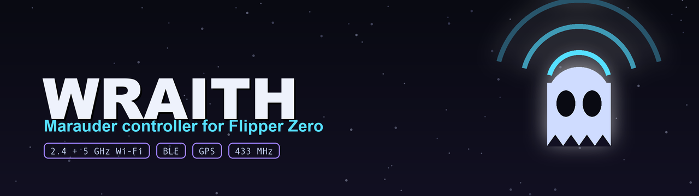
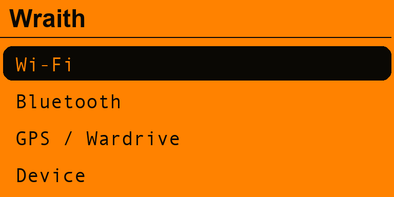
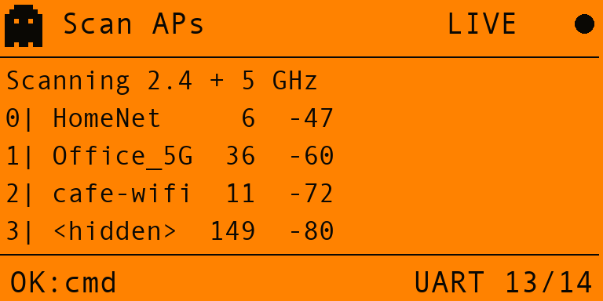
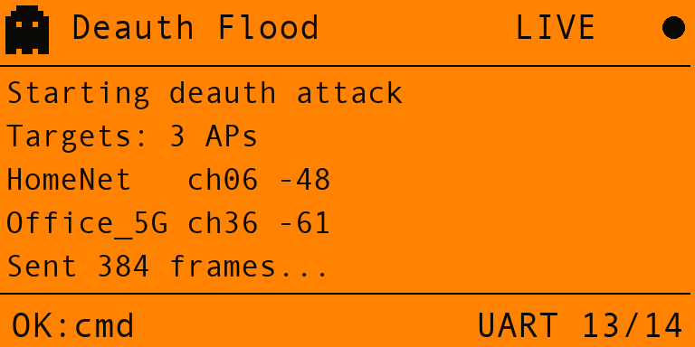
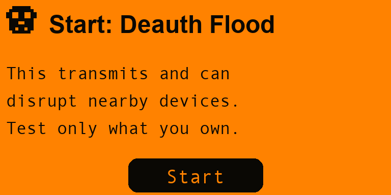

<!-- banner -->
<p align="center">
  
</p>

<h1 align="center">Wraith 👻</h1>
<p align="center"><i>A ghost in the airwaves.</i></p>

<p align="center">
  
  
  
  
  
</p>

<p align="center">
  <b>Wraith</b> turns your Flipper Zero into a clean, fast front-end for an <b>ESP32 Marauder</b>
  companion board — <b>dual-band 2.4 &amp; 5 GHz Wi-Fi</b>, <b>Bluetooth LE</b>, <b>GPS</b> and
  <b>433 MHz</b>. The Flipper is the brain and the UI; the board is the radio. They talk over the
  GPIO UART, and Wraith drives the standard Marauder command interface with tidy menus and a
  <b>live serial console</b> that speaks any command you throw at it.
</p>

<p align="center"><sub>A <b>wraith</b> is a ghost that haunts a place unseen — fitting for a tool that watches, probes and rattles the wireless spectrum around you.</sub></p>

---

## 📟 On the Flipper

<p align="center">
  
  &nbsp;
  
  &nbsp;
  
  &nbsp;
  
</p>
<p align="center">
  <sub><b>Menu</b> · <b>Scan</b> — 2.4 + 5 GHz APs &nbsp;·&nbsp; <b>Console</b> — live Marauder output &nbsp;·&nbsp; <b>Confirm</b> — attacks are gated</sub>
</p>

---

## ✨ Features

- 👻 **Live serial console** — the heart of Wraith. Every operation streams the board's real output into a scrolling terminal with a branded header, link indicator and channel readout. Scroll back through history, or hit **OK** to type *any* raw Marauder command.
- 📡 **Wi-Fi (2.4 + 5 GHz)** — scan APs & stations, a **channel analyzer**, **set channel** (2.4/5 GHz), and the full sniffer set: beacons, probes, deauth, **PMKID**, **pwnagotchi**, ESP and **raw**.
- 🎯 **Targeting** — list APs/stations, select one by index, select all, or clear the lists — then the attacks act on your selection.
- 💥 **Attacks** — deauth flood, beacon spam (list / random / AP-clone), probe flood and the classic rickroll beacon. Every attack is **gated behind a confirmation** you can toggle off.
- 📛 **SSID list builder** — generate random SSIDs, add named ones, remove or clear them, then feed **Beacon Spam (list)**.
- 🔵 **Bluetooth** — sniff BLE, detect card skimmers, **scan for AirTags**, and **BLE Spam** for Apple / Samsung / Google / Windows (plus **Sour Apple**).
- 🛰️ **GPS / Wardrive** — read live GPS data and run AP / station **wardriving** with the onboard GPS antenna.
- 🧰 **Device tools** — dump the command **help**, read **board settings**, clear all lists, **update firmware** (SD) and reboot.
- 🎚️ **Tunable** — pick the UART pins (13/14 or 15/16), toggle autoscroll, the attack-confirm gate, and sound / vibration / LED feedback.
- 🔌 **Firmware-agnostic** — menus cover the stable Marauder commands; the Console reaches everything else, so Wraith keeps working as the firmware evolves.
- 🕶️ **Local & private** — it all runs on your own hardware. No cloud, no accounts, nothing phones home.

---

## 🧠 How it works

The Flipper Zero has **no 2.4/5 GHz Wi-Fi radio of its own**. So Wraith splits the job: an
**ESP32 Marauder board is the radio**, and the **Flipper is the brain + UI**. Wraith sends
line-oriented Marauder commands over the GPIO UART at **115200 8N1**; the board streams its
text output back, and the console view reassembles and renders it live.

```
 ┌──────────────┐   UART @115200    ┌────────────────────────────┐
 │  Flipper Zero │  TX ───────────▶ │  ESP32 Marauder board       │
 │   (Wraith UI) │  RX ◀─────────── │  2.4/5 GHz Wi-Fi · BLE      │
 │               │  GND ─────────── │  GPS · 433 MHz              │
 └──────────────┘                   └────────────────────────────┘
```

---

## 🔌 Hardware & wiring

Wraith works with an **ESP32 Marauder** companion board flashed with the upstream
[ESP32 Marauder firmware](https://github.com/justcallmekoko/ESP32Marauder). It's designed
around dual-chip **ESP32-C5** boards that add **5 GHz** Wi-Fi alongside the usual 2.4 GHz, plus
onboard **GPS** and a **433 MHz** module — but it also drives plain single-band Marauder boards.

Set the UART pins in **Settings → UART pins** to match your wiring:

| Setting | Flipper pins | Typical board |
|---|---|---|
| `13/14` | 13 = TX, 14 = RX | Standard Wi-Fi dev boards |
| `15/16` | 15 = TX, 16 = RX | Dual-band / GPS boards that keep 13/14 free for GPS |

Share a common **GND**. The 433 MHz module is driven by the Flipper's own **Sub-GHz → External**
mode (not through Wraith).

---

## 🛠️ Build & install

Wraith builds with [**ufbt**](https://github.com/flipperdevices/flipperzero-ufbt):

```bash
python3 -m pip install --upgrade ufbt
git clone https://github.com/at0m-b0mb/Wraith-FlipperZero.git
cd Wraith-FlipperZero
ufbt            # builds dist/wraith.fap
ufbt launch     # build + install + run on a connected Flipper
```

Or grab `dist/wraith.fap` and drop it on the SD card under `apps/GPIO/`.

---

## ▶️ Using it

A typical Wi-Fi flow:

1. **Wi-Fi → Scan APs** — the console fills with nearby 2.4/5 GHz networks.
2. **Wi-Fi → Targets** — `List APs`, then `Select AP by #` to pick a target (or `Select ALL`).
3. **Wi-Fi → Attacks → Deauth Flood** — confirm the prompt, and the attack runs against your selection.
4. **Back** stops the running operation; you're never more than a click from stopping.

**Console** (top menu or **OK** inside any live view) opens a free terminal — type any Marauder
command (`help`, `channel -s 6`, `evilportal`, …) and watch it run.

### Command map

| Menu | Marauder command |
|---|---|
| Scan APs / Stations | `scanap` · `scansta` |
| Channel Analyzer · Set Channel | `sigmon` · `channel -s <n>` |
| Sniffers | `sniffbeacon` · `sniffprobe` · `sniffdeauth` · `sniffpmkid` · `sniffpwn` · `sniffesp` · `sniffraw` |
| Targets | `list -a/-s` · `select -a/-s <n>` · `select -a all` · `clearlist -a/-s` |
| SSID List | `ssid -a -g <n>` · `ssid -a -n <name>` · `ssid -r <n>` · `list -c` · `clearlist -c` |
| Deauth Flood | `attack -t deauth` |
| Beacon Spam (list / random / AP) | `attack -t beacon -l/-r/-a` |
| Probe Flood · Rickroll | `attack -t probe` · `attack -t rickroll` |
| Bluetooth | `sniffbt` · `sniffskim` · `sniffairtag` |
| BLE Spam | `blespam -t apple/samsung/google/windows/all` · `sourapple` |
| GPS / Wardrive | `gpsdata` · `wardrive` · `stationwardrive` |
| Device | `help` · `settings` · `clearlist -a/-s/-c` · `update` · `reboot` |

---

## ⚠️ Legal & responsible use

Wraith is built for **learning, research and authorised security testing**. Transmitting deauth
frames, beacon spam and probe floods is **disruptive and is illegal against networks and devices
you don't own or have explicit written permission to test**. You are solely responsible for how
you use it. Use it on **your own lab**, or with permission — never in the wild.

The attack-confirmation gate is on by default for a reason. Leave it on.

---

## 🙌 Credits

- **[ESP32 Marauder](https://github.com/justcallmekoko/ESP32Marauder)** by *justcallmekoko* — the open-source firmware Wraith speaks to. All the radio magic is theirs.
- Built with [ufbt](https://github.com/flipperdevices/flipperzero-ufbt) and the Flipper Zero SDK.
- Wraith app by **[at0m-b0mb](https://github.com/at0m-b0mb)**.

## 📄 License

[MIT](LICENSE) © 2026 at0m-b0mb
